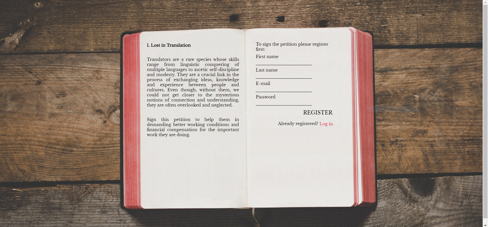
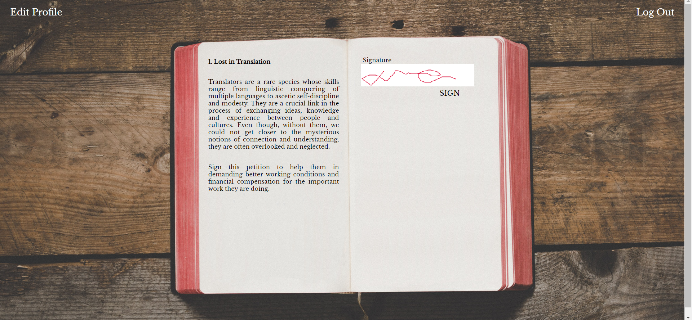

# Found in Translation

Web application for collecting signatures.

## Description

After successful registration and log in users can sign the petition.

They can redo their signature and edit their profile details.

They can see the list of signers.

## Stack

-   Javascript
-   Handlebars
-   Node / Express
-   PostgreSQL

## [Explore on your own](https://foundintranslationpetition.herokuapp.com/login)

## Future Features

-   Account deletion
-   Next page with signers
